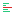

# CSS Analyzer

<div align="center">
  
</div>

<div align="center">
  <a href="https://npmjs.org/package/@projectwallace/css-analyzer"></a>
  <a href="https://npmjs.org/package/@projectwallace/css-analyzer"></a>
  <a href="https://packagephobia.com/result?p=%40projectwallace%2Fcss-analyzer"></a>
</div>

<div align="center">
Turn your CSS into <b>actionable stats</b> — specificity, complexity, design tokens, and 200+ more metrics.
</div>

## Features

- Extremely **detailed** (200+ metrics)
- **TypeScript** types built-in, zero config
- Runs anywhere — **NodeJS and browsers**
- Tiny footprint, only one dependency
- **Design system** audit ready (token usage, uniqueness ratios)
- Battle-tested — powers [Project Wallace](https://www.projectwallace.com)

## Install

```sh
npm install @projectwallace/css-analyzer
```

## Usage

### Analyzing CSS

```js
import { analyze } from '@projectwallace/css-analyzer'

const result = analyze(`
	p {
		color: blue;
		font-size: 100%;
	}

	.component[data-state="loading"] {
		background-color: whitesmoke;
	}
`)
```

<details>
  <summary>Output looks roughly like this:</summary>

```json
{
	"stylesheet": {
		"sourceLinesOfCode": 0,
		"linesOfCode": 1,
		"size": 0,
		"comments": {
			"total": 0,
			"size": 0
		},
		"embeddedContent": {
			"size": {
				"total": 0,
				"ratio": 0
			},
			"types": {
				"total": 0,
				"totalUnique": 0,
				"uniquenessRatio": 0,
				"unique": {}
			}
		},
		"complexity": 0
	},
	"atrules": {
		"total": 0,
		"totalUnique": 0,
		"unique": {},
		"uniquenessRatio": 0,
		"fontface": {
			"total": 0,
			"totalUnique": 0,
			"unique": [],
			"uniquenessRatio": 0
		},
		"import": {
			"total": 0,
			"totalUnique": 0,
			"unique": {},
			"uniquenessRatio": 0
		},
		"media": {
			"total": 0,
			"totalUnique": 0,
			"unique": {},
			"uniquenessRatio": 0,
			"browserhacks": {
				"total": 0,
				"totalUnique": 0,
				"unique": {},
				"uniquenessRatio": 0
			},
			"features": {
				"total": 0,
				"totalUnique": 0,
				"unique": {},
				"uniquenessRatio": 0
			}
		},
		"charset": {
			"total": 0,
			"totalUnique": 0,
			"unique": {},
			"uniquenessRatio": 0
		},
		"supports": {
			"total": 0,
			"totalUnique": 0,
			"unique": {},
			"uniquenessRatio": 0,
			"browserhacks": {
				"total": 0,
				"totalUnique": 0,
				"unique": {},
				"uniquenessRatio": 0
			}
		},
		"keyframes": {
			"total": 0,
			"totalUnique": 0,
			"unique": {},
			"uniquenessRatio": 0,
			"defined": [],
			"used": [],
			"unused": [],
			"unknown": [],
			"prefixed": {
				"total": 0,
				"totalUnique": 0,
				"unique": {},
				"uniquenessRatio": 0,
				"ratio": 0
			}
		},
		"container": {
			"total": 0,
			"totalUnique": 0,
			"unique": {},
			"uniquenessRatio": 0,
			"names": {
				"total": 0,
				"totalUnique": 0,
				"unique": {},
				"uniquenessRatio": 0,
				"defined": [],
				"used": [],
				"unused": [],
				"unknown": []
			}
		},
		"layer": {
			"total": 0,
			"totalUnique": 0,
			"unique": {},
			"uniquenessRatio": 0,
			"defined": [],
			"used": [],
			"unused": [],
			"unknown": []
		},
		"property": {
			"total": 0,
			"totalUnique": 0,
			"unique": {},
			"uniquenessRatio": 0
		},
		"function": {
			"total": 0,
			"totalUnique": 0,
			"unique": {},
			"uniquenessRatio": 0
		},
		"scope": {
			"total": 0,
			"totalUnique": 0,
			"unique": {},
			"uniquenessRatio": 0
		},
		"complexity": {
			"min": 0,
			"max": 0,
			"mean": 0,
			"mode": 0,
			"range": 0,
			"sum": 0
		},
		"nesting": {
			"min": 0,
			"max": 0,
			"mean": 0,
			"mode": 0,
			"range": 0,
			"sum": 0,
			"items": [],
			"total": 0,
			"totalUnique": 0,
			"unique": {},
			"uniquenessRatio": 0
		}
	},
	"rules": {
		"total": 0,
		"empty": {
			"total": 0,
			"ratio": 0
		},
		"sizes": {
			"min": 0,
			"max": 0,
			"mean": 0,
			"mode": 0,
			"range": 0,
			"sum": 0,
			"items": [],
			"unique": {},
			"total": 0,
			"totalUnique": 0,
			"uniquenessRatio": 0
		},
		"nesting": {
			"min": 0,
			"max": 0,
			"mean": 0,
			"mode": 0,
			"range": 0,
			"sum": 0,
			"items": [],
			"total": 0,
			"totalUnique": 0,
			"unique": {},
			"uniquenessRatio": 0
		},
		"selectors": {
			"min": 0,
			"max": 0,
			"mean": 0,
			"mode": 0,
			"range": 0,
			"sum": 0,
			"items": [],
			"unique": {},
			"total": 0,
			"totalUnique": 0,
			"uniquenessRatio": 0
		},
		"declarations": {
			"min": 0,
			"max": 0,
			"mean": 0,
			"mode": 0,
			"range": 0,
			"sum": 0,
			"items": [],
			"unique": {},
			"total": 0,
			"totalUnique": 0,
			"uniquenessRatio": 0
		}
	},
	"selectors": {
		"total": 0,
		"totalUnique": 0,
		"uniquenessRatio": 0,
		"specificity": {
			"min": [0, 0, 0],
			"max": [0, 0, 0],
			"sum": [0, 0, 0],
			"mean": [0, 0, 0],
			"mode": [0, 0, 0],
			"items": [],
			"unique": {},
			"total": 0,
			"totalUnique": 0,
			"uniquenessRatio": 0
		},
		"complexity": {
			"min": 0,
			"max": 0,
			"mean": 0,
			"mode": 0,
			"range": 0,
			"sum": 0,
			"total": 0,
			"totalUnique": 0,
			"unique": {},
			"uniquenessRatio": 0,
			"items": []
		},
		"nesting": {
			"min": 0,
			"max": 0,
			"mean": 0,
			"mode": 0,
			"range": 0,
			"sum": 0,
			"items": [],
			"total": 0,
			"totalUnique": 0,
			"unique": {},
			"uniquenessRatio": 0
		},
		"id": {
			"total": 0,
			"totalUnique": 0,
			"unique": {},
			"uniquenessRatio": 0,
			"ratio": 0
		},
		"pseudoClasses": {
			"total": 0,
			"totalUnique": 0,
			"unique": {},
			"uniquenessRatio": 0
		},
		"pseudoElements": {
			"total": 0,
			"totalUnique": 0,
			"unique": {},
			"uniquenessRatio": 0
		},
		"accessibility": {
			"total": 0,
			"totalUnique": 0,
			"unique": {},
			"uniquenessRatio": 0,
			"ratio": 0
		},
		"attributes": {
			"total": 0,
			"totalUnique": 0,
			"unique": {},
			"uniquenessRatio": 0
		},
		"customElements": {
			"total": 0,
			"totalUnique": 0,
			"unique": {},
			"uniquenessRatio": 0
		},
		"keyframes": {
			"total": 0,
			"totalUnique": 0,
			"unique": {},
			"uniquenessRatio": 0
		},
		"prefixed": {
			"total": 0,
			"totalUnique": 0,
			"unique": {},
			"uniquenessRatio": 0,
			"ratio": 0
		},
		"combinators": {
			"total": 0,
			"totalUnique": 0,
			"unique": {},
			"uniquenessRatio": 0
		}
	},
	"declarations": {
		"total": 0,
		"totalUnique": 0,
		"uniquenessRatio": 0,
		"importants": {
			"total": 0,
			"ratio": 0,
			"inKeyframes": {
				"total": 0,
				"ratio": 0
			}
		},
		"complexity": {
			"min": 0,
			"max": 0,
			"mean": 0,
			"mode": 0,
			"range": 0,
			"sum": 0
		},
		"nesting": {
			"min": 0,
			"max": 0,
			"mean": 0,
			"mode": 0,
			"range": 0,
			"sum": 0,
			"items": [],
			"total": 0,
			"totalUnique": 0,
			"unique": {},
			"uniquenessRatio": 0
		}
	},
	"properties": {
		"total": 0,
		"totalUnique": 0,
		"unique": {},
		"uniquenessRatio": 0,
		"prefixed": {
			"total": 0,
			"totalUnique": 0,
			"unique": {},
			"uniquenessRatio": 0,
			"ratio": 0
		},
		"custom": {
			"total": 0,
			"totalUnique": 0,
			"unique": {},
			"uniquenessRatio": 0,
			"defined": [],
			"used": [],
			"unused": [],
			"unknown": [],
			"ratio": 0,
			"importants": {
				"total": 0,
				"totalUnique": 0,
				"unique": {},
				"uniquenessRatio": 0,
				"ratio": 0
			}
		},
		"shorthands": {
			"total": 0,
			"totalUnique": 0,
			"unique": {},
			"uniquenessRatio": 0,
			"ratio": 0
		},
		"browserhacks": {
			"total": 0,
			"totalUnique": 0,
			"unique": {},
			"uniquenessRatio": 0,
			"ratio": 0
		},
		"complexity": {
			"min": 0,
			"max": 0,
			"mean": 0,
			"mode": 0,
			"range": 0,
			"sum": 0
		},
		"anchorNames": {
			"defined": [],
			"used": [],
			"unused": [],
			"unknown": []
		}
	},
	"values": {
		"colors": {
			"total": 0,
			"totalUnique": 0,
			"unique": {},
			"uniquenessRatio": 0,
			"itemsPerContext": {},
			"formats": {
				"total": 0,
				"totalUnique": 0,
				"unique": {},
				"uniquenessRatio": 0
			}
		},
		"gradients": {
			"total": 0,
			"totalUnique": 0,
			"unique": {},
			"uniquenessRatio": 0
		},
		"fontFamilies": {
			"total": 0,
			"totalUnique": 0,
			"unique": {},
			"uniquenessRatio": 0
		},
		"fontSizes": {
			"total": 0,
			"totalUnique": 0,
			"unique": {},
			"uniquenessRatio": 0
		},
		"lineHeights": {
			"total": 0,
			"totalUnique": 0,
			"unique": {},
			"uniquenessRatio": 0
		},
		"zindexes": {
			"total": 0,
			"totalUnique": 0,
			"unique": {},
			"uniquenessRatio": 0
		},
		"textShadows": {
			"total": 0,
			"totalUnique": 0,
			"unique": {},
			"uniquenessRatio": 0
		},
		"boxShadows": {
			"total": 0,
			"totalUnique": 0,
			"unique": {},
			"uniquenessRatio": 0
		},
		"borderRadiuses": {
			"total": 0,
			"totalUnique": 0,
			"unique": {},
			"itemsPerContext": {},
			"uniquenessRatio": 0
		},
		"animations": {
			"durations": {
				"total": 0,
				"totalUnique": 0,
				"unique": {},
				"uniquenessRatio": 0
			},
			"timingFunctions": {
				"total": 0,
				"totalUnique": 0,
				"unique": {},
				"uniquenessRatio": 0
			},
			"names": {
				"total": 0,
				"totalUnique": 0,
				"unique": {},
				"uniquenessRatio": 0
			}
		},
		"prefixes": {
			"total": 0,
			"totalUnique": 0,
			"unique": {},
			"uniquenessRatio": 0
		},
		"browserhacks": {
			"total": 0,
			"totalUnique": 0,
			"unique": {},
			"uniquenessRatio": 0
		},
		"units": {
			"total": 0,
			"totalUnique": 0,
			"unique": {},
			"uniquenessRatio": 0,
			"itemsPerContext": {}
		},
		"complexity": {
			"min": 0,
			"max": 0,
			"mean": 0,
			"mode": 0,
			"range": 0,
			"sum": 0
		},
		"keywords": {
			"total": 0,
			"totalUnique": 0,
			"unique": {},
			"uniquenessRatio": 0
		},
		"resets": {
			"total": 0,
			"totalUnique": 0,
			"unique": {},
			"uniquenessRatio": 0
		},
		"displays": {
			"total": 0,
			"totalUnique": 0,
			"unique": {},
			"uniquenessRatio": 0
		}
	}
}
```

</details>

### Comparing specificity

```js
import { compareSpecificity } from '@projectwallace/css-analyzer'

const result = [
	[0, 1, 1],
	[2, 0, 0],
	[0, 0, 1],
].sort((a, b) => compareSpecificity(a, b))

// => result:
// [
//   [2,0,0],
//   [0,1,1],
//   [0,0,1],
// ]

const isSpecificityEqual = compareSpecificity([0, 1, 0], [0, 1, 0]) === 0
// => isSpecificityEqual: true
```

## Acknowledgements

Browser hack patterns for value detection were sourced from:

- [Always Twisted - ReLiCSS Old CSS](https://www.alwaystwisted.com/relicss/old-css)
- [Browserhacks](https://browserhacks.com/)

## Related projects

- [CSS Design Tokens](https://github.com/projectwallace/css-design-tokens) - Get DTCG tokens from CSS (uses this css-analyzer)
- [Wallace CLI](https://github.com/projectwallace/wallace-cli) - CLI tool for
  @projectwallace/css-analyzer
- [Color Sorter](https://github.com/projectwallace/color-sorter) - Sort CSS colors
  by hue, saturation, lightness and opacity
- [Project Wallace Stylelint plugin pack](https://github.com/projectwallace/stylelint-plugin) - Lint your CSS based on the metrics in this CSS analyzer
